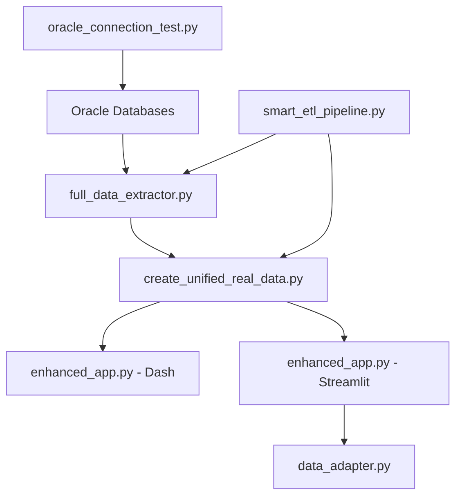

# HungerHub POC - ETL Implementation Guide

## 📋 Overview

This document provides a comprehensive guide to the ETL (Extract, Transform, Load) implementation in the HungerHub POC, detailing all code files under `src/` and their role in the data pipeline.

## 🏗️ ETL Architecture

The HungerHub ETL system implements a **sequential extraction strategy** that extracts data from Oracle databases, transforms it into unified formats, and loads it for dashboard consumption.

```
┌─────────────────┐    ┌──────────────────┐    ┌─────────────────┐
│   EXTRACTION    │    │  TRANSFORMATION  │    │      LOAD       │
│                 │    │                  │    │                 │
│ Oracle → Raw    │ => │ Raw → Unified    │ => │ Unified → Apps  │
│ Data Files      │    │ Data Files       │    │ & Dashboards    │
└─────────────────┘    └──────────────────┘    └─────────────────┘
```

## 📁 File Organization by ETL Phase

### 🗂️ Directory Structure

```
src/
├── data_extraction/          # EXTRACT phase
├── etl_pipeline/            # TRANSFORM phase  
├── dashboard/               # LOAD phase
├── analytics/               # Analysis layer
├── deprecated/              # Historical implementations
└── smart_etl_pipeline.py    # Advanced ETL orchestration
```

---

## 🔄 ETL Phase 1: EXTRACTION

### Core Extraction Files (Independent Execution)

#### 1. **`src/data_extraction/full_data_extractor.py`** ⭐ **MAIN EXTRACTOR**
- **Purpose**: Production-grade Oracle data extractor using proven sequential strategy
- **Execution**: **Independent** - Run directly from command line
- **Capabilities**:
  - Extracts **complete tables** (no sampling limits)
  - Handles **542K+ records** from high-priority Oracle tables
  - Achieves **1,100+ rows/sec** throughput
  - Supports multiple priority tiers (high/medium/all)
- **Key Tables**:
  - `AMX_DONATION_LINES` (27,099 records)
  - `RW_ORDER_ITEM` (230,282 records) 
  - `RW_PURCHASE_ORDER` (96,552 records)
  - `AMX_DONATION_HEADER` (1,389 records)
- **Usage**:
  ```bash
  python src/data_extraction/full_data_extractor.py --tier all_priority
  ```
- **Output**: Raw CSV + Processed Parquet files in `data/processed/real/`

#### 2. **`src/data_extraction/oracle_connection_test.py`**
- **Purpose**: Test Oracle database connectivity before extraction
- **Execution**: **Independent** - Connectivity validation
- **Usage**:
  ```bash
  python src/data_extraction/oracle_connection_test.py
  ```

#### 3. **`src/data_extraction/database_connectivity_report.py`**
- **Purpose**: Generate detailed connectivity reports for troubleshooting
- **Execution**: **Independent** - Diagnostic tool
- **Output**: JSON reports in `logs/`

#### 4. **`src/data_extraction/oracle_table_discovery.py`**
- **Purpose**: Discover and catalog available Oracle tables
- **Execution**: **Independent** - Schema exploration
- **Output**: Table metadata and structure analysis

### Legacy Extraction Files (Deprecated)

#### 5. **`src/deprecated/data_extraction/real_data_extractor.py`**
- **Purpose**: Original sampled data extractor (DEPRECATED)
- **Limitation**: Uses **sampling limits** (5K records max per table)
- **Status**: Replaced by `full_data_extractor.py`
- **Note**: This is what created the current 5,000-record dashboard data

---

## 🔄 ETL Phase 2: TRANSFORMATION

### Core Transformation Files (Independent Execution)

#### 6. **`src/data_extraction/create_unified_real_data.py`** ⭐ **MAIN TRANSFORMER**
- **Purpose**: Transform raw Oracle data into dashboard-ready unified datasets
- **Execution**: **Independent** - Run after extraction
- **Input**: Raw parquet files from `full_data_extractor.py`
- **Transformations**:
  - **Donations**: Merge header + lines, standardize columns, add calculated fields
  - **Organizations**: Unify Choice + Agency org data, common schema
  - **Orders/Procurement**: Join order items + suppliers + purchase orders
- **Output**: 
  - `data/processed/unified_real/donations.csv` (main dashboard data)
  - `data/processed/unified_real/organizations.csv`
  - `data/processed/unified_real/orders.csv`
- **Usage**:
  ```bash
  python src/data_extraction/create_unified_real_data.py
  ```

#### 7. **`src/smart_etl_pipeline.py`** 
- **Purpose**: Advanced ETL orchestration with intelligent connection detection
- **Execution**: **Independent** - Smart pipeline execution
- **Features**:
  - Auto-detects database availability (REAL vs MOCK mode)
  - Comprehensive data quality validation
  - Schema validation with business rules
  - Error handling and fallback strategies
- **Usage**: Can orchestrate entire ETL process intelligently

### Specialized Transformation Files

#### 8. **`src/dashboard/streamlit/data_adapter.py`**
- **Purpose**: Adapt unified data for Streamlit dashboard consumption
- **Execution**: **Invoked by Streamlit dashboard**
- **Transformations**:
  - Maps donations → services (for dashboard compatibility)
  - Maps organizations → people
  - Adds missing columns with reasonable defaults
  - Handles data loading errors with mock fallback

### Legacy Transformation Files (Deprecated)

#### 9. **`src/deprecated/pipeline/etl_pipeline.py`**
- **Purpose**: Original ETL pipeline implementation (DEPRECATED)
- **Status**: Replaced by newer implementations

---

## 🔄 ETL Phase 3: LOAD (Dashboard Consumption)

### Dashboard Applications (Runtime Data Loading)

#### 10. **`src/dashboard/dash/enhanced_app.py`** ⭐ **DASH DASHBOARD**
- **Purpose**: Enhanced Dash dashboard application
- **Execution**: **Runtime** - Launched via `launch_enhanced_dash.sh`
- **Data Loading**: 
  - Loads from `data/processed/unified_real/donations.csv`
  - Loads from `data/processed/unified_real/organizations.csv`
  - **Fallback**: Creates mock data if files missing
- **Port**: 8050
- **Features**: Executive dashboard, analytics, performance metrics

#### 11. **`src/dashboard/streamlit/enhanced_app.py`** ⭐ **STREAMLIT DASHBOARD**
- **Purpose**: Enhanced Streamlit dashboard application  
- **Execution**: **Runtime** - Launched via `launch_enhanced_streamlit.sh`
- **Data Loading**:
  - Uses `data_adapter.py` to load and transform unified data
  - **Fallback**: Mock data generation if real data unavailable
- **Port**: 8501
- **Features**: Multi-tab interface, interactive analytics

#### 12. **`src/dashboard/dash/app.py`**
- **Purpose**: Basic Dash dashboard (legacy)
- **Status**: Superseded by `enhanced_app.py`

#### 13. **`src/dashboard/streamlit/main_app.py`**
- **Purpose**: Basic Streamlit dashboard (legacy)
- **Status**: Superseded by `enhanced_app.py`

### Supporting Dashboard Files

#### 14. **`src/dashboard/logging_config.py`**
- **Purpose**: Centralized logging configuration for dashboard apps
- **Execution**: **Imported** by dashboard applications

#### 15. **`src/dashboard/streamlit/logging_config.py`**
- **Purpose**: Streamlit-specific logging configuration
- **Execution**: **Imported** by Streamlit apps

---

## 📊 ETL Phase 4: ANALYTICS LAYER

### Analytics Engine Files

#### 16. **`src/analytics_engine.py`** / **`src/analytics_engine_fixed.py`**
- **Purpose**: Advanced analytics processing on unified data
- **Execution**: **Independent** or **Invoked by dashboards**
- **Features**: Statistical analysis, trend detection, performance metrics
- **Status**: Available for advanced analytics workflows

### Deprecated Analytics Files

#### 17. **`src/deprecated/analytics/analytics_engine.py`**
- **Purpose**: Original analytics implementation (DEPRECATED)
- **Status**: Moved to deprecated folder

---

## 🗂️ SUPPORTING & UTILITY FILES

### Configuration Files

#### 18. **`src/__init__.py`**
- **Purpose**: Package initialization for src module
- **Execution**: **Imported** - Python package setup

#### 19. **`src/data_extraction/__init__.py`**
- **Purpose**: Data extraction package initialization
- **Execution**: **Imported** - Package structure

### Deprecated & Legacy Files

#### 20. **`src/deprecated/` directory**
- **Contents**: Historical implementations, backup files
- **Purpose**: Preserves evolution of ETL system
- **Status**: Not used in production pipeline

---

## 🚀 ETL EXECUTION WORKFLOW

### Complete ETL Pipeline Execution Order:

#### **Phase 1: Setup & Testing**
```bash
# 1. Test database connectivity
python src/data_extraction/oracle_connection_test.py

# 2. Generate connectivity report (optional)
python src/data_extraction/database_connectivity_report.py

# 3. Discover Oracle tables (optional)
python src/data_extraction/oracle_table_discovery.py
```

#### **Phase 2: Data Extraction (Independent)**
```bash
# 4. Extract ALL Oracle data (recommended)
python src/data_extraction/full_data_extractor.py --tier all_priority

# Alternative: Extract by priority level
python src/data_extraction/full_data_extractor.py --tier high_priority
```

#### **Phase 3: Data Transformation (Independent)**
```bash
# 5. Create unified dashboard datasets
python src/data_extraction/create_unified_real_data.py
```

#### **Phase 4: Dashboard Launch (Runtime)**
```bash
# 6a. Launch Dash dashboard (port 8050)
./launch_enhanced_dash.sh

# 6b. Launch Streamlit dashboard (port 8501)  
./launch_enhanced_streamlit.sh
```

#### **Alternative: Smart Pipeline (All-in-One)**
```bash
# Intelligent ETL execution with auto-detection
python src/smart_etl_pipeline.py
```

---

## 📈 DATA FLOW SUMMARY

### Current Status (5,000 Records):
```
Oracle DB → old sampled extractor → 5K records → unified data → dashboards
```

### Full Data Pipeline (542K+ Records):
```
Oracle DB → full_data_extractor → 542K+ records → create_unified_real_data → enhanced dashboards
```

---

## 🎯 KEY INSIGHTS

### **Independent vs Invoked Files:**

#### **Independent Execution** (Run manually):
- `full_data_extractor.py` - **Main extraction**
- `create_unified_real_data.py` - **Main transformation** 
- `oracle_connection_test.py` - **Connectivity testing**
- `database_connectivity_report.py` - **Diagnostics**
- `oracle_table_discovery.py` - **Schema exploration**
- `smart_etl_pipeline.py` - **Smart orchestration**

#### **Runtime Invoked** (Called by dashboards):
- `enhanced_app.py` files - **Dashboard applications**
- `data_adapter.py` - **Data loading & adaptation**
- `logging_config.py` files - **Configuration**

### **Current Limitation:**
The dashboards currently show **5,000 sampled records** because they're using data from the deprecated `real_data_extractor.py`. To show **full Oracle data (542K+ records)**, run the complete pipeline using `full_data_extractor.py` → `create_unified_real_data.py`.

### **Production Recommendation:**
1. Use `full_data_extractor.py` for extraction
2. Use `create_unified_real_data.py` for transformation  
3. Launch enhanced dashboards for visualization
4. Monitor via logging and connectivity reports

---

## 📚 File Dependencies



This ETL implementation provides a robust, scalable foundation for the HungerHub POC with clear separation of concerns and comprehensive data processing capabilities.
