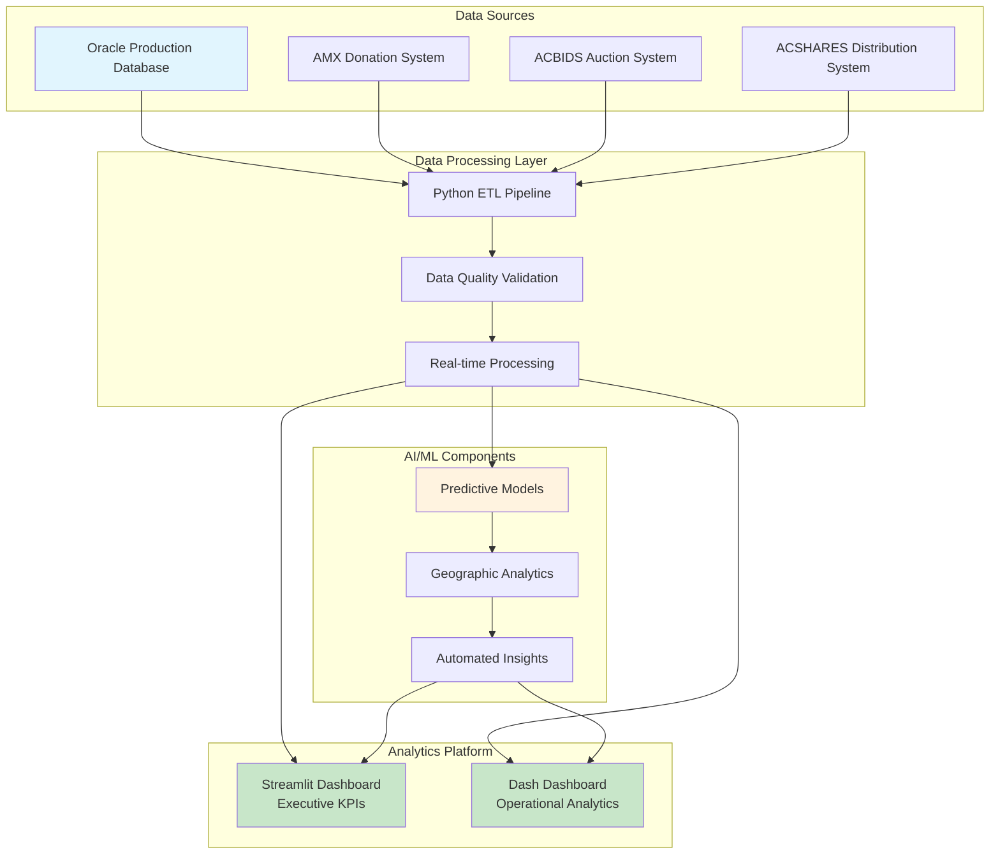
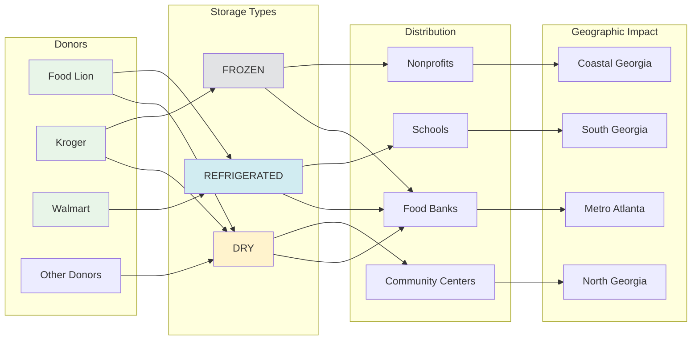
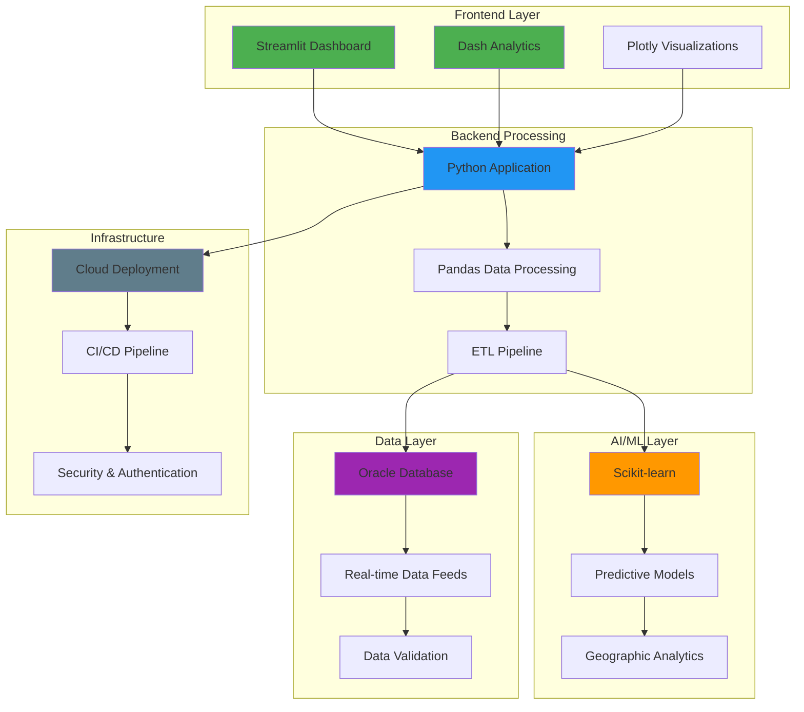
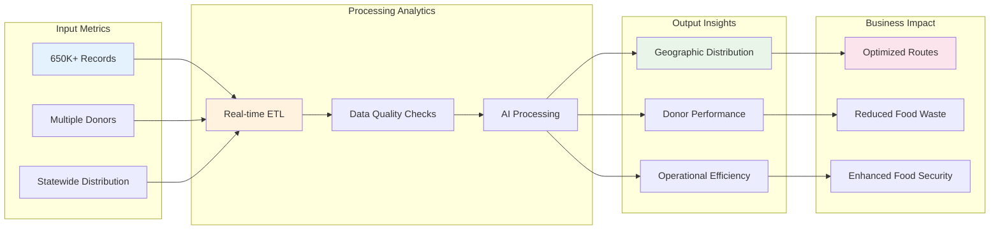
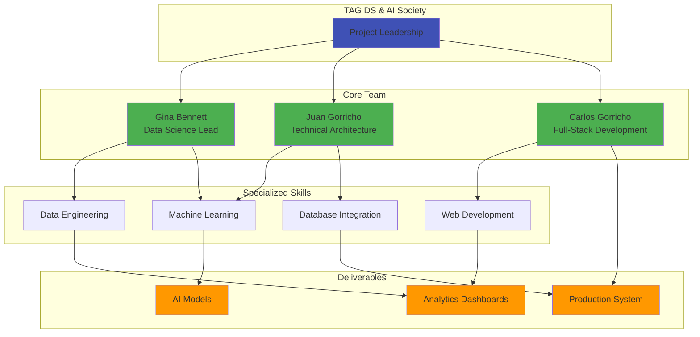
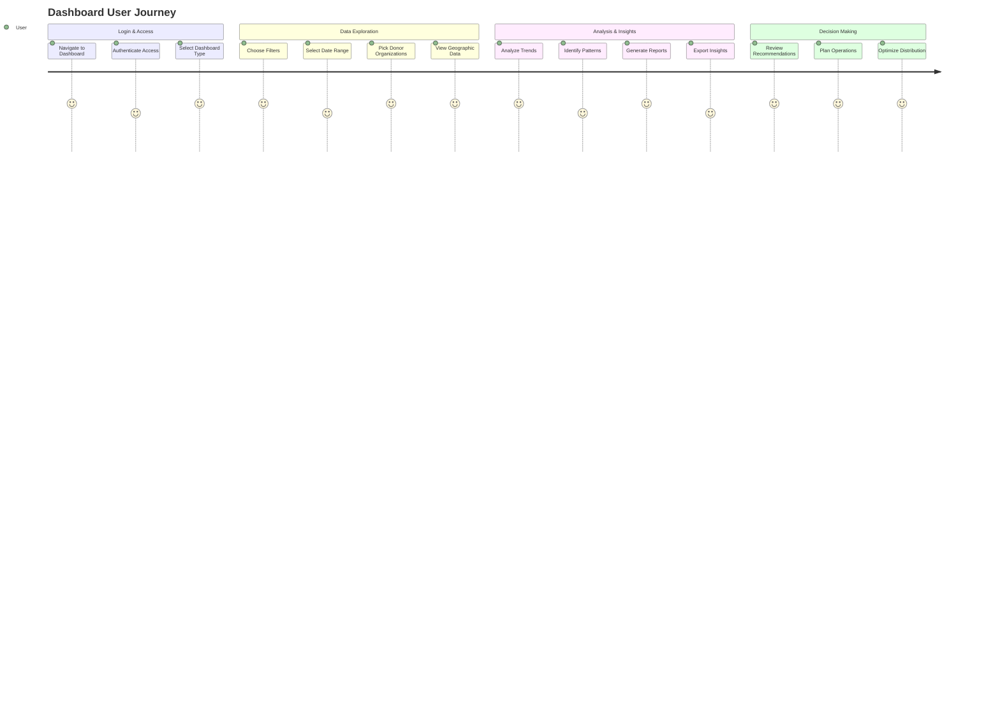
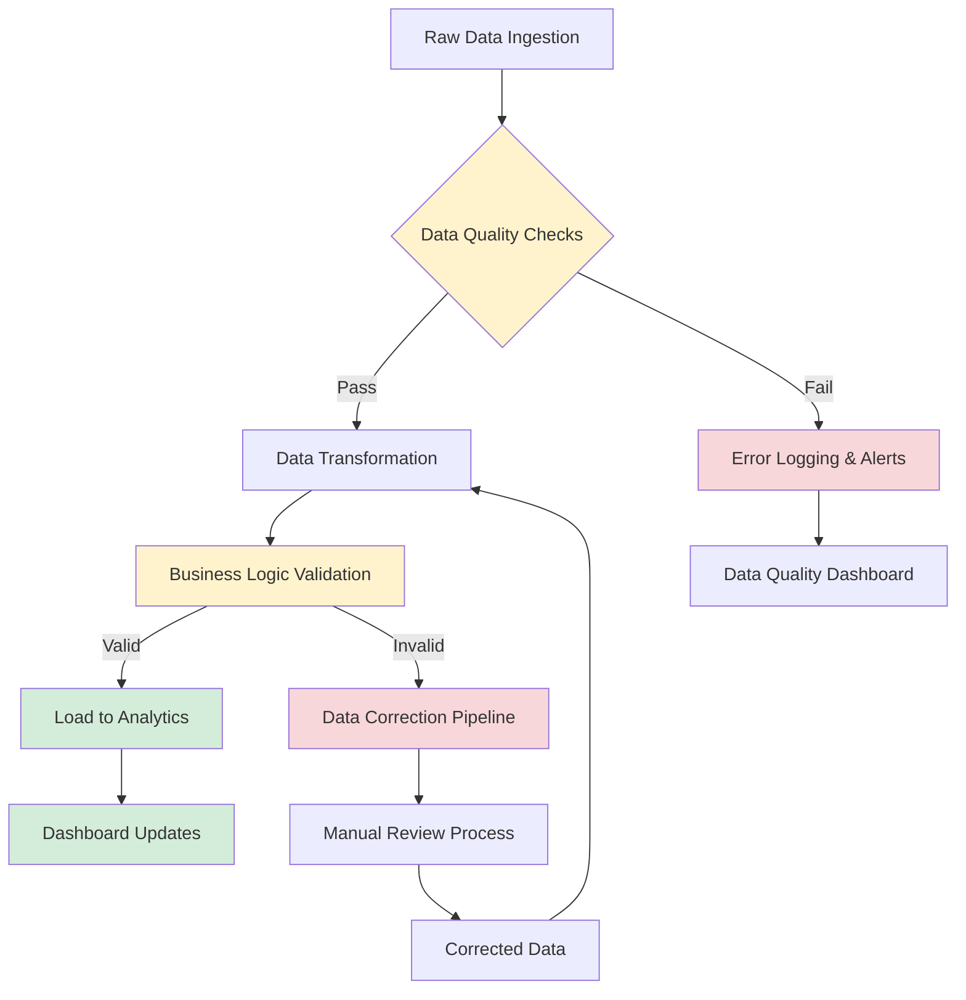
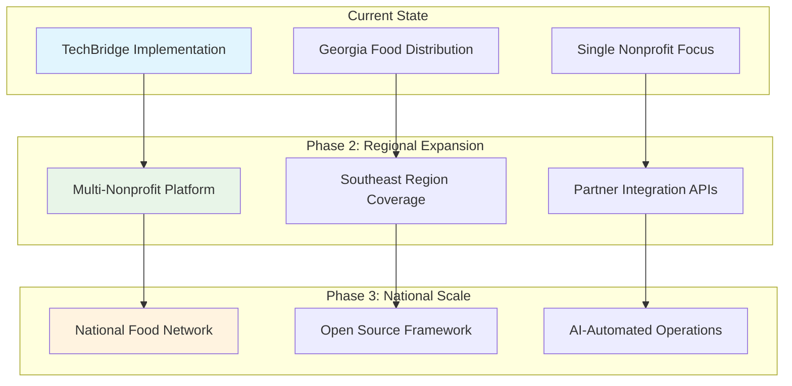

# Mermaid Diagrams for Gamma.app Presentation
## HungerHub Analytics Project Visual Documentation

---

## 1. SOLUTION ARCHITECTURE DIAGRAM



---

## 2. DATA FLOW DIAGRAM



---

## 3. PROJECT TIMELINE

```mermaid
timeline
    title HungerHub Analytics Development Timeline
    
    section Phase 1: Discovery & Planning
        Week 1-2    : Data Source Analysis
                    : Requirements Gathering
                    : Technical Architecture Design
    
    section Phase 2: Data Infrastructure
        Week 3-4    : Oracle Database Integration
                    : ETL Pipeline Development
                    : Data Quality Framework
    
    section Phase 3: Analytics Development
        Week 5-6    : Streamlit Dashboard Creation
                    : Dash Analytics Platform
                    : Interactive Visualizations
    
    section Phase 4: AI & Advanced Analytics
        Week 7-8    : Predictive Model Development
                    : Geographic Analytics
                    : Automated Insights Engine
    
    section Phase 5: Deployment & Testing
        Week 9-10   : Production Deployment
                    : User Acceptance Testing
                    : Performance Optimization
    
    section Phase 6: Launch & Training
        Week 11-12  : Go-Live Support
                    : User Training Sessions
                    : Documentation & Handover
```

---

## 4. TECHNOLOGY STACK



---

## 5. IMPACT METRICS FLOW



---

## 6. VOLUNTEER TEAM STRUCTURE



---

## 7. USER INTERACTION FLOW



---

## 8. DATA QUALITY & VALIDATION PROCESS



---

## 9. SCALABILITY & FUTURE GROWTH



---

*These diagrams can be imported directly into Gamma.app for enhanced visual presentation*
